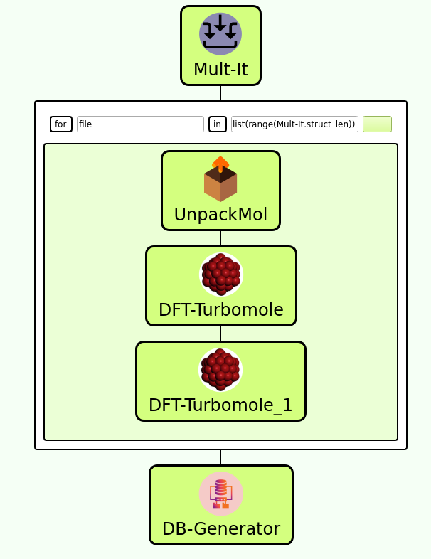
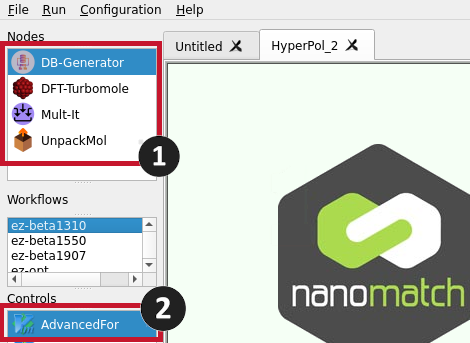
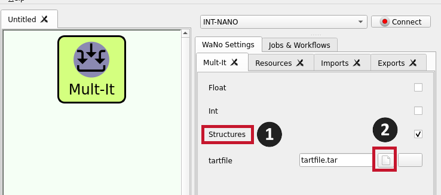
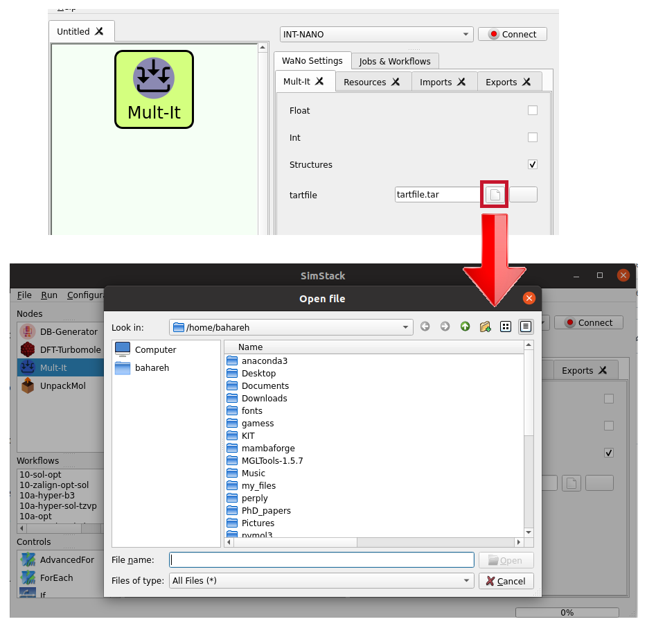
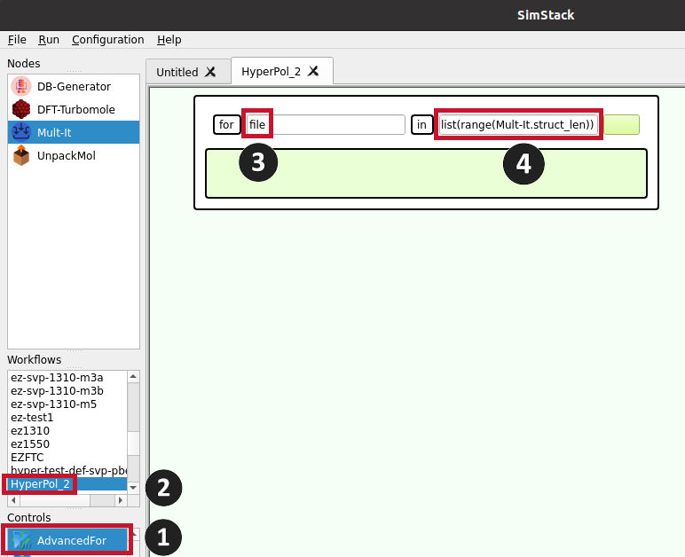

**Welcome to DFT-Turbomole, a WaNo designed for predicting hyperpolarizability in molecules. Our workflow leverages Density Functional Theory (DFT) calculations using the Turbomole software suite. This WaNo enables efficient computation and screening of hyperpolarizability across a diverse range of molecular structures.**
---
# DFT-Turbomole WaNo

The DFT-Turbomole WANO is a workflow automation tool designed for computational chemistry tasks, focusing primarily on hyperpolarizability calculations. This tool facilitates the calculation of various molecular properties, including:
- Geometry optimization
- Frequency calculation
- Excited state calculation
- Hyperpolarizability calculation

These calculations can be performed for molecules in both gas phase and solution environments. However, the primary purpose of this workflow automation tool is to streamline hyperpolarizability calculations, aiding in the screening and assessment of molecular candidates for applications in nonlinear optics and related fields. Figure 1 depicts the workflow layout.

<figure align="centering">
    
    <figcaption>Figure 1: This figure illustrates the workflow for calculating hyperpolarizability. The workflow encompasses the following components: Mult-It, UnpackMol, DFT-Turbomole, DFT-Turbomole_1, DB-Generator Wanos, and a for loop.
</figcaption>
</figure>

This document describes the components of the workflow and provides instructions on how to use them.
# Workflow Creation in Simstack
Upon launching Simstack, navigate to the top left corner of the screen where you'll find all necessary Wanos modules listed under the "Nodes" section (refer to Number 1 in Figure 2). The "AdvancedFor" for loop is situated within the "Controls" section (see Number 2 in Figure 2).

## Creating a Workflow
To construct your workflow, follow these steps:

1- **Drag and Drop:** Begin by dragging the Wanos modules and the "AdvancedFor" loop into your workspace in the specified order:
 - Mult-It
 - AdvancedFor
 - UnpackMol
 - DFT-Turbomole (twice; the first instance for geometry optimization calculations, and the second instance, named DFT-Turbomole_1, for hyperpolarizability calculations)
 - DB-Generator

2- **Configure the Loop:** Ensure that UnpackMol, DFT-Turbomole, and DFT-Turbomole_1 are encapsulated within the "AdvancedFor" loop as depicted in Figure 1.

3- **Adjustment:** You can reposition and reorder the modules on the screen by clicking and dragging them as needed.

## Note 
Carefully place and order the UnpackMol, DFT-Turbomole, and DFT-Turbomole_1 modules within the "AdvancedFor" loop to ensure the workflow operates correctly.

<figure align="centering">
    
    <figcaption>Figure 2: This figure illustrates the placement of all Wanos components and loops required to create a workflow.
</figcaption>
</figure>

All components will be explained in the following section.

# Wanos
## Mul-It
This Wano (Figure 3) allows users to upload multiple input files simultaneously. Users should prepare all necessary structure files in a folder and create a tar file on their own computer. Although there are various options available in this Wano, the only essential option is "structure" (see number 1 in Figure 3). The rest of the options should remain unchanged for this workflow. By selecting "structure," the "tarfile" section will appear. Clicking the paper icon next to the filename box (number 2 in Figure 3) will guide the user to the desktop paths (Figure 4), where the tar file can be located and selected.

<figure align="centering">
    
    <figcaption>Figure 3: Overview of Wano interface showing key user options. Note the 'structure' option at position 1, essential for this workflow.
</figcaption>
</figure>

<figure align="centering">
    
    <figcaption>Figure 4: File selection interface accessed by clicking the paper icon near the filename box (shown in Figure 3). This interface helps users navigate and select the necessary tar file from their desktop paths.
</figcaption>
</figure>

## AdvancedFor
To use the For loop in the workspace, simply drag the "AdvancedFor" from the "Controls" section (see number 1 in Figure 5) and drop it into the workspace. This workflow processes all files previously uploaded via the tar file using the "Mult-It" Wano, performing the desired action on them. The loop variable should always be named "file" for the for command (see number 3 in Figure 5), and the command should be set to "list(range(Mult-It.struct_len))" for this Wano (see number 4 in Figure 5). To use this command, double-click on "HyperPol_2" under the "Workflows" section (see number 2 in Figure 5).

<figure align="centering">
    
    <figcaption>Figure 5: Workspace setup showing the placement of 'AdvancedFor' in the workflow, key configuration fields for the for loop, and how to initiate the command in the 'Mult-It' Wano.
</figcaption>
</figure>

## DFT-Turbomole
# Parameters
In this section, we will explain each of the following parameters in detail:
- **Title:** Provide the title of the calculation or project.
- **Molecular Structure**
    - _**Structure file type:**_ Specify the type of structure file being used (XYZ, Turbomole coord, Gaussian input).
    - _**Structure file:**_ The actual structure file containing the molecular coordinates.
    - _**Internal coordinates:**_ Information on the internal coordinates used for defining the molecule.
- **Basis set**
    - _**Basis set type:**_ Specify the type of basis set employed in the calculation.
- **Initial guess**
    - _**Charge:**_ Indicate the total charge of the molecule.
    - _**Multiplicity:**_ Specify the multiplicity of the molecule.
- **DFT options**
    - _**Max SCF iterations:**_ Set the maximum number of SCF (Self-Consistent Field) iterations.
    - _**Use RI:**_ Specify whether the RI (Resolution of Identity) approximation is used.
    - _**Memory for RI:**_ Allocate memory for RI calculations.
    - _**Functional:**_ Specify the DFT functional used.
    - _**Integration grid:**_ Define the integration grid used for the DFT calculations.
    - _**vdw correction:**_ Indicate if van der Waals correction is needed.
    - _**COSMO calculation:**_ Specify if COSMO calculations are needed.
- **Type of calculation**
    - _**Structure optimization:**_ Performing geometry optimization if you select this option. The final structure will be stored in the output directory.
    - _**Excited states calculation:**_ Computing the electronic states of a molecule that are higher in energy than the ground state using the Time-Dependent Density Functional Theory (TD-DFT) method.
    - _**Hyperpolarizability:**_ DFT-Turbomole is able to calculate the first hyperpolarizability for both static and dynamic frequencies. By default, Turbomole calculates the first hyperpolarizability for the second harmonic generation case. However, this WaNo is designed to calculate hyperpolarizability for the Pockels effect as well.
    - _**Frequency calculation:**_ Calculate second derivatives of the energy with respect to nuclear positions. This can be chosen either with the structure optimization parameter or alone.
    - _**Plot HOMO-LUMO orbt:**_  If you need to see the frontier orbitals, selecting this parameter will calculate the related cube files.

# Input
The only needed input file is xyz structure of the molecule.
