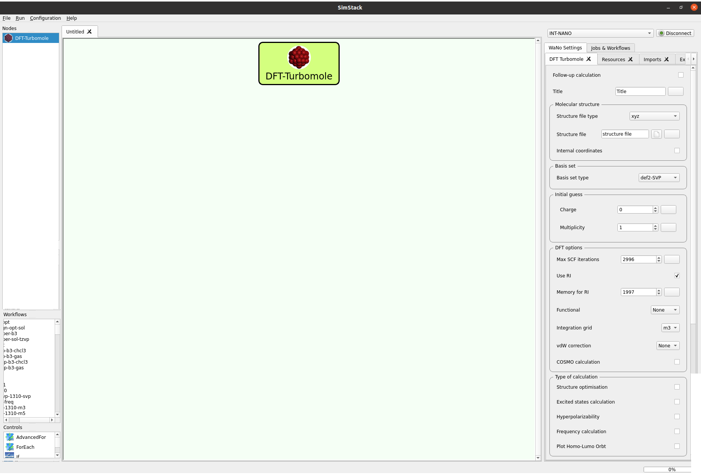

**Welcome to DFT-Turbomole, a WaNo designed for predicting hyperpolarizabilities in molecules. Our workflow leverages Density Functional Theory (DFT) calculations using the Turbomole software suite. This WaNo enables efficient computation and screening of hyperpolarizabilities across a diverse range of molecular structures.**
---
# DFT-Turbomole WaNo

The DFT-Turbomole WANO is a workflow automation tool designed for computational chemistry tasks, focusing primarily on hyperpolarizability calculations. This tool facilitates the calculation of various molecular properties, including:
- Geometry optimization
- Frequency calculation
- Excited state calculation
- Hyperpolarizability calculation

These calculations can be performed for molecules in both gas phase and solution environments. However, the primary purpose of this workflow automation tool is to streamline hyperpolarizability calculations, aiding in the screening and assessment of molecular candidates for applications in nonlinear optics and related fields. The only needed input file is xyz structure of the molecule.

===
